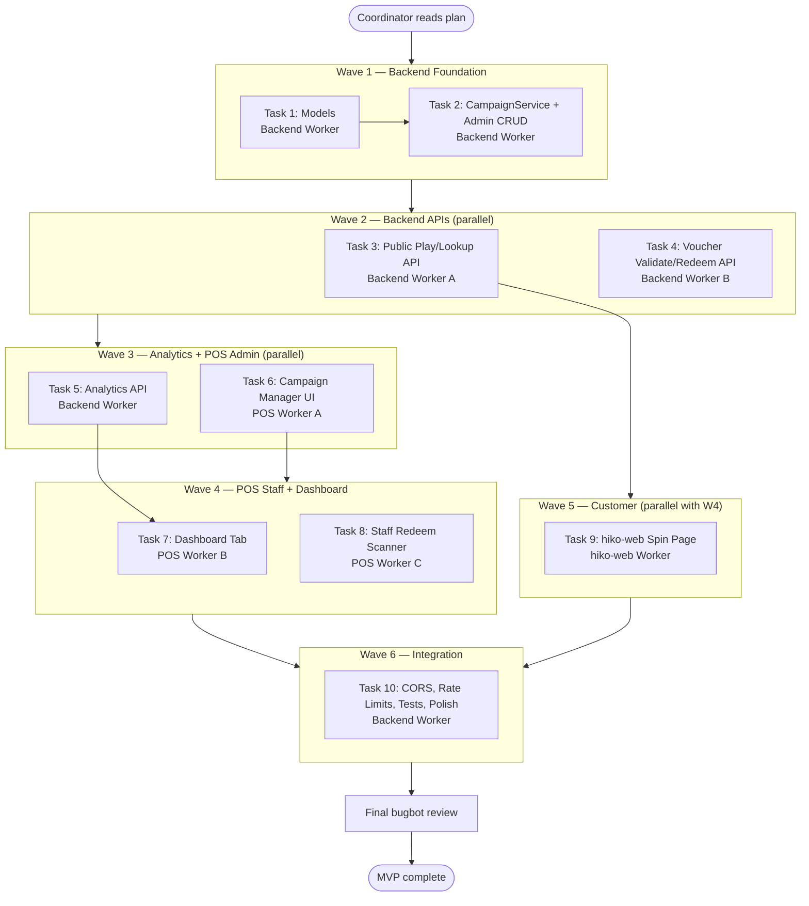
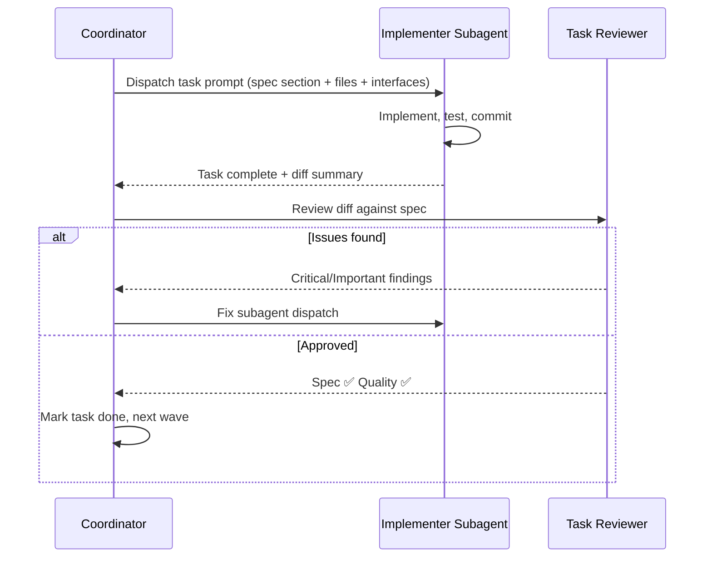

# Redeem Reward Implementation Plan

> **For agentic workers:** REQUIRED SUB-SKILL: Use superpowers:subagent-driven-development (recommended) or superpowers:executing-plans to implement this plan task-by-task. Steps use checkbox (`- [ ]`) syntax for tracking.

**Goal:** Build a brand-wide spin-game campaign system: admin creates campaigns, customers play on hiko-web, staff validate vouchers via QR scan in POS, admin analyzes results on a Dashboard tab.

**Architecture:** New standalone `campaign` module in Hiko-POS backend (models → services → controllers → routes). Three frontend surfaces: POS admin (Campaign Manager + Dashboard tab), POS staff (QR redeem scanner), hiko-web customer spin page with Astro API proxy. Server-side weighted random for spin fairness; atomic voucher redeem.

**Tech Stack:** MongoDB/Mongoose, Express/TypeScript, React 18 + Redux Toolkit + Tailwind (POS), Astro 6 + Tailwind 4 (hiko-web), `html5-qrcode` (staff scanner), `qrcode` (customer QR display)

**Spec:** `docs/superpowers/specs/2026-08-04-redeem-reward-design.md`

## Global Constraints

- Phone validation: `/^\d{10}$/` (same as existing `Customer` model)
- Campaign scope: brand-wide (no per-store restriction on campaigns)
- Redeem at POS: validate-only (no auto-apply to order in v1)
- Voucher expiry: none after win; expires when campaign ends or is deactivated
- Spin: server-side weighted random; client animates only
- No `any` in pos-backend TypeScript (use `unknown`, interfaces, `MongoFilter`)
- Follow existing Route → Controller → Service → Model pattern
- Admin routes: JWT + `isAdmin`; staff redeem: JWT + `storeContext`; public play/lookup: rate-limited, no auth

---

## Sub-Agent Orchestration

### Roles

| Role | Subagent type | Responsibility |
|------|---------------|----------------|
| **Coordinator** | Parent agent | Read plan, dispatch workers, run task reviews, track progress |
| **Backend Worker** | `generalPurpose` | Models, services, controllers, routes, integration tests |
| **POS Frontend Worker** | `generalPurpose` | pos-frontend pages, components, Redux, routing |
| **hiko-web Worker** | `generalPurpose` | Astro spin page, API proxy, wheel UI |
| **Task Reviewer** | `bugbot` or parent | Spec compliance + code quality after each task |
| **Final Reviewer** | `bugbot` | Whole-branch review when all tasks complete |

### Execution Flow



### Per-Task Sub-Agent Loop

For **each task**, the coordinator runs:



### Parallelism Rules

| Can run in parallel | Must wait for |
|---------------------|---------------|
| Task 3 + Task 4 | Task 2 |
| Task 6 + Task 5 | Task 2 (Task 6 needs admin CRUD API) |
| Task 7 + Task 8 | Task 5 (dashboard), Task 4 (redeem) |
| Task 9 | Task 3 (public play/lookup APIs) |
| Task 10 | All tasks 1–9 |

### Sub-Agent Dispatch Prompt Template

Each implementer subagent receives:

```
Full Repository Path: /Users/khn6352/out/Hiko-POS (or hiko-web for Task 9)
Task: [Task N title]
Spec: docs/superpowers/specs/2026-08-04-redeem-reward-design.md (section X)
Plan: docs/superpowers/plans/2026-08-04-redeem-reward.md (Task N)

Interfaces from prior tasks:
- [list exact function names, routes, types]

Files to create/modify:
- [exact paths]

Do NOT touch unrelated files.
Run tests listed in task before marking complete.
Commit with message: feat(campaign): [description]
```

---

## File Structure

### Backend — New Files (Hiko-POS)
- `pos-backend/models/campaignModel.ts`
- `pos-backend/models/campaignParticipationModel.ts`
- `pos-backend/models/campaignVoucherModel.ts`
- `pos-backend/types/campaign.ts` — shared TS interfaces
- `pos-backend/services/campaignService.ts` — CRUD, spin, lookup, eligibility
- `pos-backend/services/campaignAnalyticsService.ts` — dashboard aggregations
- `pos-backend/services/voucherService.ts` — validate, redeem, token generation
- `pos-backend/utils/campaignUtils.ts` — weighted random, voucher code gen, phone mask
- `pos-backend/controllers/campaignController.ts`
- `pos-backend/controllers/voucherController.ts`
- `pos-backend/routes/campaignRoute.ts`
- `pos-backend/routes/voucherRoute.ts`
- `pos-backend/tests/campaignPlay.integration.test.ts`
- `pos-backend/tests/voucherRedeem.integration.test.ts`

### Backend — Modified Files
- `pos-backend/app.ts` — mount routes, CORS, rate limiters

### Frontend POS — New Files
- `pos-frontend/src/pages/CampaignManager.jsx`
- `pos-frontend/src/pages/RedeemReward.jsx`
- `pos-frontend/src/components/campaign/CampaignForm.jsx`
- `pos-frontend/src/components/campaign/WheelSlotEditor.jsx`
- `pos-frontend/src/components/campaign/CampaignList.jsx`
- `pos-frontend/src/components/dashboard/RedeemRewardDashboard.jsx`
- `pos-frontend/src/redux/slices/campaignSlice.js`

### Frontend POS — Modified Files
- `pos-frontend/src/https/index.js`
- `pos-frontend/src/redux/store.js`
- `pos-frontend/src/pages/Dashboard.jsx`
- `pos-frontend/src/pages/index.js`
- `pos-frontend/src/constants/index.js`
- `pos-frontend/src/App.jsx`
- `pos-frontend/src/components/shared/Sidebar.jsx`

### hiko-web — New Files
- `hiko-web/src/pages/spin/[slug].astro`
- `hiko-web/src/components/spin/SpinWheel.tsx`
- `hiko-web/src/components/spin/PhoneForm.tsx`
- `hiko-web/src/components/spin/VoucherDisplay.tsx`
- `hiko-web/src/pages/api/campaign/[slug]/play.ts`
- `hiko-web/src/pages/api/campaign/[slug]/lookup.ts`
- `hiko-web/src/pages/api/campaign/[slug]/public.ts`

### hiko-web — Modified Files
- `hiko-web/vercel.json` — CSP `connect-src`
- `hiko-web/.env.example` — `HIKO_POS_API_URL`

---

## Task 1: Campaign Data Models

**Subagent:** Backend Worker  
**Wave:** 1 (sequential, first task)  
**Depends on:** nothing

**Files:**
- Create: `pos-backend/types/campaign.ts`
- Create: `pos-backend/models/campaignModel.ts`
- Create: `pos-backend/models/campaignParticipationModel.ts`
- Create: `pos-backend/models/campaignVoucherModel.ts`

**Interfaces — Produces:**
```typescript
// pos-backend/types/campaign.ts
export type WheelRewardType = "percentage_discount" | "free_product" | "no_prize";
export type VoucherStatus = "active" | "redeemed" | "expired";

export interface WheelSlot {
  label: string;
  rewardType: WheelRewardType;
  discountPercent?: number;
  freeDish?: string; // ObjectId as string
  weight: number;
  color: string;
}

export interface PlayResultWin {
  result: "win";
  reward: { label: string; type: "percentage_discount" | "free_product"; discountPercent?: number; freeDish?: string };
  voucher: { code: string; qrToken: string; expiresAt: string | null };
  playsRemaining: number;
}

export interface PlayResultLose {
  result: "lose";
  message: string;
  playsRemaining: number;
}
```

- [ ] **Step 1: Create types file**

Create `pos-backend/types/campaign.ts` with interfaces above plus `CampaignDashboardAnalytics` matching spec response shape.

- [ ] **Step 2: Create Campaign model**

Create `pos-backend/models/campaignModel.ts`:

```typescript
import mongoose from "mongoose";
import type { WheelSlot } from "../types/campaign.js";

const wheelSlotSchema = new mongoose.Schema({
  label: { type: String, required: true, trim: true, maxlength: 100 },
  rewardType: {
    type: String,
    required: true,
    enum: ["percentage_discount", "free_product", "no_prize"],
  },
  discountPercent: { type: Number, min: 0, max: 100 },
  freeDish: { type: mongoose.Schema.Types.ObjectId, ref: "Dish" },
  weight: { type: Number, required: true, min: 1 },
  color: { type: String, required: true, match: /^#[0-9A-Fa-f]{6}$/ },
}, { _id: true });

const campaignSchema = new mongoose.Schema({
  name: { type: String, required: true, trim: true, maxlength: 100 },
  slug: {
    type: String,
    required: true,
    unique: true,
    trim: true,
    lowercase: true,
    match: /^[a-z0-9-]+$/,
  },
  description: { type: String, trim: true, maxlength: 500, default: "" },
  startDate: { type: Date },
  endDate: { type: Date },
  isActive: { type: Boolean, default: true },
  maxPlaysPerPhone: { type: Number, default: 1, min: 1 },
  wheelSlots: {
    type: [wheelSlotSchema],
    validate: {
      validator: (v: WheelSlot[]) => Array.isArray(v) && v.length >= 2,
      message: "Campaign must have at least 2 wheel slots",
    },
  },
  createdBy: { type: mongoose.Schema.Types.ObjectId, ref: "User", required: true },
}, { timestamps: true });

campaignSchema.index({ slug: 1 }, { unique: true });
campaignSchema.index({ isActive: 1, startDate: 1, endDate: 1 });

export default mongoose.model("Campaign", campaignSchema);
```

- [ ] **Step 3: Create CampaignParticipation model**

Create `pos-backend/models/campaignParticipationModel.ts`:

```typescript
import mongoose from "mongoose";

const campaignParticipationSchema = new mongoose.Schema({
  campaign: { type: mongoose.Schema.Types.ObjectId, ref: "Campaign", required: true },
  phone: { type: String, required: true, trim: true, match: /^\d{10}$/ },
  customer: { type: mongoose.Schema.Types.ObjectId, ref: "Customer" },
  playCount: { type: Number, default: 0, min: 0 },
  lastPlayedAt: { type: Date },
}, { timestamps: true });

campaignParticipationSchema.index({ campaign: 1, phone: 1 }, { unique: true });

export default mongoose.model("CampaignParticipation", campaignParticipationSchema);
```

- [ ] **Step 4: Create CampaignVoucher model**

Create `pos-backend/models/campaignVoucherModel.ts`:

```typescript
import mongoose from "mongoose";

const campaignVoucherSchema = new mongoose.Schema({
  campaign: { type: mongoose.Schema.Types.ObjectId, ref: "Campaign", required: true },
  participation: { type: mongoose.Schema.Types.ObjectId, ref: "CampaignParticipation", required: true },
  voucherCode: { type: String, required: true, unique: true, uppercase: true },
  qrToken: { type: String, required: true, unique: true },
  rewardType: { type: String, required: true, enum: ["percentage_discount", "free_product"] },
  discountPercent: { type: Number, min: 0, max: 100 },
  freeDish: { type: mongoose.Schema.Types.ObjectId, ref: "Dish" },
  rewardLabel: { type: String, required: true },
  status: { type: String, required: true, enum: ["active", "redeemed", "expired"], default: "active" },
  wonAt: { type: Date, required: true, default: Date.now },
  expiresAt: { type: Date },
  redeemedAt: { type: Date },
  redeemedBy: { type: mongoose.Schema.Types.ObjectId, ref: "User" },
  redeemedAtStore: { type: mongoose.Schema.Types.ObjectId, ref: "Store" },
}, { timestamps: true });

campaignVoucherSchema.index({ voucherCode: 1 }, { unique: true });
campaignVoucherSchema.index({ qrToken: 1 }, { unique: true });
campaignVoucherSchema.index({ campaign: 1, status: 1 });

export default mongoose.model("CampaignVoucher", campaignVoucherSchema);
```

- [ ] **Step 5: Verify compile**

Run: `cd pos-backend && npm run build`  
Expected: PASS (no errors in new files)

- [ ] **Step 6: Commit**

```bash
git add pos-backend/types/campaign.ts pos-backend/models/campaignModel.ts \
  pos-backend/models/campaignParticipationModel.ts pos-backend/models/campaignVoucherModel.ts
git commit -m "feat(campaign): add Campaign, Participation, and Voucher models"
```

---

## Task 2: CampaignService + Admin CRUD API

**Subagent:** Backend Worker  
**Wave:** 1  
**Depends on:** Task 1

**Files:**
- Create: `pos-backend/utils/campaignUtils.ts`
- Create: `pos-backend/services/campaignService.ts`
- Create: `pos-backend/controllers/campaignController.ts`
- Create: `pos-backend/routes/campaignRoute.ts`
- Modify: `pos-backend/app.ts`

**Interfaces — Consumes:** Models from Task 1  
**Interfaces — Produces:**
```typescript
// campaignService.ts exports
export class CampaignService {
  static async listCampaigns(): Promise<CampaignDoc[]>
  static async getCampaignById(id: string): Promise<CampaignDoc | null>
  static async getCampaignBySlug(slug: string): Promise<CampaignDoc | null>
  static async createCampaign(data: CreateCampaignInput, userId: string): Promise<CampaignDoc>
  static async updateCampaign(id: string, data: UpdateCampaignInput): Promise<CampaignDoc | null>
  static async deactivateCampaign(id: string): Promise<CampaignDoc | null>
  static isCampaignPlayable(campaign: CampaignDoc): { ok: boolean; reason?: string }
}

// campaignUtils.ts exports
export function pickWeightedSlot(slots: WheelSlot[]): WheelSlot
export function generateVoucherCode(): string  // "HK-XXXXXX"
export function generateQrToken(): string      // crypto.randomUUID()
export function maskPhone(phone: string): string  // "09****1234"
```

- [ ] **Step 1: Create campaignUtils**

```typescript
// pos-backend/utils/campaignUtils.ts
import crypto from "crypto";
import type { WheelSlot } from "../types/campaign.js";

export function pickWeightedSlot(slots: WheelSlot[]): WheelSlot {
  const total = slots.reduce((sum, s) => sum + s.weight, 0);
  let r = Math.random() * total;
  for (const slot of slots) {
    r -= slot.weight;
    if (r <= 0) return slot;
  }
  return slots[slots.length - 1];
}

export function generateVoucherCode(): string {
  const chars = "ABCDEFGHJKLMNPQRSTUVWXYZ23456789";
  let code = "HK-";
  for (let i = 0; i < 6; i++) {
    code += chars[crypto.randomInt(chars.length)];
  }
  return code;
}

export function generateQrToken(): string {
  return crypto.randomUUID();
}

export function maskPhone(phone: string): string {
  if (phone.length !== 10) return phone;
  return `${phone.slice(0, 2)}****${phone.slice(-4)}`;
}
```

- [ ] **Step 2: Create CampaignService (CRUD + eligibility)**

Implement `campaignService.ts` with CRUD methods and:

```typescript
static isCampaignPlayable(campaign: CampaignDoc, now = new Date()): { ok: boolean; reason?: string } {
  if (!campaign.isActive) return { ok: false, reason: "Campaign is not active" };
  if (campaign.startDate && now < campaign.startDate) return { ok: false, reason: "Campaign has not started" };
  if (campaign.endDate && now > campaign.endDate) return { ok: false, reason: "Campaign has ended" };
  return { ok: true };
}
```

Validate wheel slots on create/update:
- `percentage_discount` requires `discountPercent`
- `free_product` requires `freeDish`
- `no_prize` requires neither
- Total weight > 0

- [ ] **Step 3: Create campaignController**

Follow `promotionController.ts` pattern. Admin-only handlers:
- `listCampaigns`, `getCampaignById`, `createCampaign`, `updateCampaign`, `deactivateCampaign`

Use `isVerifiedUser` + `isAdmin` middleware (check existing admin middleware pattern in codebase).

- [ ] **Step 4: Create campaignRoute + mount in app.ts**

```typescript
// pos-backend/routes/campaignRoute.ts
import express from "express";
import { isVerifiedUser } from "../middlewares/tokenVerification.js";
import { isAdmin } from "../middlewares/isAdmin.js"; // or inline check
import { listCampaigns, getCampaignById, createCampaign, updateCampaign, deactivateCampaign } from "../controllers/campaignController.js";

const router = express.Router();

// Public routes added in Task 3 BEFORE /:id routes
router.use(isVerifiedUser, isAdmin);
router.get("/", listCampaigns);
router.post("/", createCampaign);
router.get("/:id", getCampaignById);
router.put("/:id", updateCampaign);
router.delete("/:id", deactivateCampaign);

export default router;
```

Mount in `app.ts`:
```typescript
import campaignRoute from "./routes/campaignRoute.js";
app.use("/api/campaign", campaignRoute);
```

**Important:** Register analytics route `GET /analytics/dashboard` and public routes from Tasks 3/5 **before** `/:id` to avoid route conflicts.

- [ ] **Step 5: Smoke test admin CRUD**

Run backend dev server, create campaign via curl/Postman with admin JWT cookie.

- [ ] **Step 6: Commit**

```bash
git commit -m "feat(campaign): add CampaignService and admin CRUD API"
```

---

## Task 3: Public Play & Lookup API

**Subagent:** Backend Worker A (can parallel with Task 4 after Task 2)  
**Wave:** 2  
**Depends on:** Task 2

**Files:**
- Modify: `pos-backend/services/campaignService.ts` — add `playCampaign`, `lookupVoucher`
- Modify: `pos-backend/controllers/campaignController.ts`
- Modify: `pos-backend/routes/campaignRoute.ts`
- Modify: `pos-backend/app.ts` — add `campaignPlayLimiter`

**Interfaces — Produces:**
```typescript
static async playCampaign(slug: string, phone: string): Promise<PlayResultWin | PlayResultLose | { result: "no_plays_remaining"; message: string }>
static async lookupVoucher(slug: string, phone: string): Promise<LookupResult>
static async getPublicCampaign(slug: string): Promise<PublicCampaignDTO>
```

- [ ] **Step 1: Implement playCampaign logic**

```typescript
// Core flow in campaignService.ts
static async playCampaign(slug: string, phone: string) {
  const campaign = await Campaign.findOne({ slug });
  if (!campaign) throw new NotFoundError("Campaign not found");

  const playable = this.isCampaignPlayable(campaign);
  if (!playable.ok) throw new BadRequestError(playable.reason!);

  let participation = await CampaignParticipation.findOne({ campaign: campaign._id, phone });
  if (participation && participation.playCount >= campaign.maxPlaysPerPhone) {
    // Check if they have active voucher — return lookup instead
    const existing = await CampaignVoucher.findOne({
      campaign: campaign._id,
      participation: participation._id,
      status: "active",
    });
    if (existing) { /* return win with existing voucher */ }
    return { result: "no_plays_remaining", message: "You have already played" };
  }

  // Find or create Customer
  let customer = await Customer.findOne({ phone });
  if (!customer) customer = await Customer.create({ phone, name: "" });

  if (!participation) {
    participation = await CampaignParticipation.create({
      campaign: campaign._id, phone, customer: customer._id, playCount: 0,
    });
  }

  const slot = pickWeightedSlot(campaign.wheelSlots);
  participation.playCount += 1;
  participation.lastPlayedAt = new Date();
  await participation.save();

  const playsRemaining = Math.max(0, campaign.maxPlaysPerPhone - participation.playCount);

  if (slot.rewardType === "no_prize") {
    return { result: "lose", message: "Try again next time", playsRemaining };
  }

  const voucherCode = generateVoucherCode();
  const qrToken = generateQrToken();
  const voucher = await CampaignVoucher.create({
    campaign: campaign._id,
    participation: participation._id,
    voucherCode,
    qrToken,
    rewardType: slot.rewardType,
    discountPercent: slot.discountPercent,
    freeDish: slot.freeDish,
    rewardLabel: slot.label,
    expiresAt: campaign.endDate ?? undefined,
  });

  return {
    result: "win",
    reward: { label: slot.label, type: slot.rewardType, discountPercent: slot.discountPercent, freeDish: slot.freeDish?.toString() },
    voucher: { code: voucher.voucherCode, qrToken: voucher.qrToken, expiresAt: voucher.expiresAt?.toISOString() ?? null },
    playsRemaining,
  };
}
```

- [ ] **Step 2: Implement lookupVoucher**

Return active voucher for phone+campaign, or status messages (redeemed, expired, no voucher).

- [ ] **Step 3: Implement getPublicCampaign**

Return `{ name, description, wheelSlots: [{ label, color }] }` — no weights exposed to client.

- [ ] **Step 4: Add public routes (before admin middleware)**

```typescript
// At TOP of campaignRoute.ts, before isVerifiedUser
router.get("/:slug/public", getPublicCampaign);
router.post("/:slug/play", campaignPlayLimiter, playCampaign);
router.post("/:slug/lookup", campaignPlayLimiter, lookupVoucher);
```

- [ ] **Step 5: Add rate limiter in app.ts**

```typescript
const campaignPlayLimiter = rateLimit({
  windowMs: 60 * 1000,
  max: 10,
  message: { success: false, message: "Too many requests, please try again later" },
});
```

- [ ] **Step 6: Write integration test**

Create `pos-backend/tests/campaignPlay.integration.test.ts` — test win, lose, no_plays_remaining, campaign ended.

Run: `cd pos-backend && npm run test:integration -- --testPathPatterns=campaignPlay`

- [ ] **Step 7: Commit**

```bash
git commit -m "feat(campaign): add public play and lookup APIs with rate limiting"
```

---

## Task 4: Voucher Validate & Redeem API

**Subagent:** Backend Worker B (parallel with Task 3)  
**Wave:** 2  
**Depends on:** Task 2

**Files:**
- Create: `pos-backend/services/voucherService.ts`
- Create: `pos-backend/controllers/voucherController.ts`
- Create: `pos-backend/routes/voucherRoute.ts`
- Modify: `pos-backend/app.ts`

**Interfaces — Produces:**
```typescript
export class VoucherService {
  static async validate(qrToken: string): Promise<VoucherPreviewDTO>
  static async redeem(qrToken: string, userId: string, storeId: string): Promise<VoucherRedeemDTO>
}
```

- [ ] **Step 1: Implement VoucherService.validate**

Load voucher by qrToken, populate campaign + freeDish. Return:
```typescript
{ valid: boolean, status: string, rewardLabel, rewardType, discountPercent?, freeDish?, voucherCode, phoneMasked, expiresAt? }
```

Check campaign still active for `active` vouchers.

- [ ] **Step 2: Implement VoucherService.redeem (atomic)**

```typescript
static async redeem(qrToken: string, userId: string, storeId: string) {
  const voucher = await CampaignVoucher.findOneAndUpdate(
    { qrToken, status: "active" },
    {
      $set: {
        status: "redeemed",
        redeemedAt: new Date(),
        redeemedBy: userId,
        redeemedAtStore: storeId,
      },
    },
    { new: true }
  );
  if (!voucher) {
    const existing = await CampaignVoucher.findOne({ qrToken });
    if (!existing) throw new NotFoundError("Invalid voucher");
    if (existing.status === "redeemed") throw new BadRequestError("Voucher already redeemed");
    if (existing.status === "expired") throw new BadRequestError("Voucher expired");
    throw new BadRequestError("Voucher cannot be redeemed");
  }
  return { success: true, voucherCode: voucher.voucherCode, rewardLabel: voucher.rewardLabel };
}
```

- [ ] **Step 3: Create voucherController + route**

```typescript
// pos-backend/routes/voucherRoute.ts
router.use(isVerifiedUser, storeContext);
router.get("/validate/:qrToken", validateVoucher);
router.post("/redeem", redeemVoucher);
```

Mount: `app.use("/api/voucher", voucherRoute);`

- [ ] **Step 4: Write integration test**

Create `pos-backend/tests/voucherRedeem.integration.test.ts` — test validate, redeem, double-redeem fails.

Run: `cd pos-backend && npm run test:integration -- --testPathPatterns=voucherRedeem`

- [ ] **Step 5: Commit**

```bash
git commit -m "feat(campaign): add voucher validate and redeem API for staff"
```

---

## Task 5: Campaign Analytics API + Dashboard Tab

**Subagent:** Backend Worker (analytics) + POS Worker B (UI)  
**Wave:** 3  
**Depends on:** Task 2 (API), Task 3/4 (data to aggregate)

**Files:**
- Create: `pos-backend/services/campaignAnalyticsService.ts`
- Modify: `pos-backend/controllers/campaignController.ts` — add `getDashboardAnalytics`
- Modify: `pos-backend/routes/campaignRoute.ts` — `GET /analytics/dashboard` (admin, before `/:id`)
- Create: `pos-frontend/src/components/dashboard/RedeemRewardDashboard.jsx`
- Create: `pos-frontend/src/redux/slices/campaignSlice.js`
- Modify: `pos-frontend/src/https/index.js`
- Modify: `pos-frontend/src/redux/store.js`
- Modify: `pos-frontend/src/pages/Dashboard.jsx`

- [ ] **Step 1: Implement CampaignAnalyticsService.getDashboard**

Query params: `startDate`, `endDate`, `campaignId?`

Use MongoDB aggregation on `CampaignParticipation` and `CampaignVoucher`:
- `summary`: totalPlays (sum playCount deltas or count play events), totalWins, totalLosses, winRate, vouchersRedeemed, redemptionRate, activeVouchers, uniqueParticipants
- `campaignPerformance[]`: group by campaign
- `prizeDistribution[]`: group vouchers by rewardLabel
- `redemptionsByStore[]`: group redeemed vouchers by redeemedAtStore
- `dailyTrend[]`: group by date(wonAt) and date(redeemedAt)
- `recentActivity[]`: last 20 wins + redemptions, phone masked

- [ ] **Step 2: Add route**

```typescript
router.get("/analytics/dashboard", isVerifiedUser, isAdmin, getDashboardAnalytics);
```

Register **before** `router.get("/:id", ...)`.

- [ ] **Step 3: Create campaignSlice.js**

```javascript
export const fetchCampaignDashboardAnalytics = createAsyncThunk(
  "campaigns/fetchDashboardAnalytics",
  async ({ startDate, endDate, campaignId }) => {
    const params = { startDate, endDate };
    if (campaignId) params.campaignId = campaignId;
    const { data } = await axiosWrapper.get("/api/campaign/analytics/dashboard", { params });
    return data;
  }
);

export const fetchCampaigns = createAsyncThunk(/* list for dropdown */);
```

- [ ] **Step 4: Create RedeemRewardDashboard.jsx**

Follow `RewardsDashboard.jsx` pattern:
- Campaign dropdown filter
- 7 KPI cards from `summary`
- Campaign Performance table (row click → set campaign filter)
- Prize Distribution + Daily Trend (two-column grid)
- `StoreSummariesTable` for redemptions by store
- Recent Activity list

Wire to `dateFilter` + `customDateRange` props from Dashboard (same date logic as `PromotionMetrics.jsx`).

- [ ] **Step 5: Add tab to Dashboard.jsx**

```javascript
const tabs = useMemo(() =>
  ["Metrics", "Promotions", ...(isAdmin ? [..., "Rewards", "Redeem Reward"] : [])],
  [isAdmin]
);

{activeTab === "Redeem Reward" && isAdmin && (
  <div className="container mx-auto px-4 md:px-6">
    <RedeemRewardDashboard dateFilter={dateFilter} customDateRange={customDateRange} />
  </div>
)}
```

- [ ] **Step 6: Manual test**

Open Dashboard → Redeem Reward tab → verify KPIs load with date filter.

- [ ] **Step 7: Commit**

```bash
git commit -m "feat(campaign): add analytics API and Redeem Reward dashboard tab"
```

---

## Task 6: Campaign Manager Admin UI

**Subagent:** POS Worker A (parallel with Task 5 backend portion)  
**Wave:** 3  
**Depends on:** Task 2

**Files:**
- Create: `pos-frontend/src/pages/CampaignManager.jsx`
- Create: `pos-frontend/src/components/campaign/CampaignList.jsx`
- Create: `pos-frontend/src/components/campaign/CampaignForm.jsx`
- Create: `pos-frontend/src/components/campaign/WheelSlotEditor.jsx`
- Modify: `pos-frontend/src/constants/index.js`, `App.jsx`, `Sidebar.jsx`, `pages/index.js`

- [ ] **Step 1: Add route constants**

```javascript
// constants/index.js
CAMPAIGNS: "/campaigns",
```

Add to `PROTECTED_ROUTES` with `adminOnly: true`.

- [ ] **Step 2: Create WheelSlotEditor**

Slot row: label, rewardType select, discountPercent (conditional), dish picker (conditional), weight, color picker.  
Show computed probability: `weight / totalWeight * 100`.

- [ ] **Step 3: Create CampaignForm**

Fields: name, slug (auto from name), description, startDate, endDate, maxPlaysPerPhone, isActive, wheelSlots array.  
Submit → POST/PUT `/api/campaign`.

- [ ] **Step 4: Create CampaignList + CampaignManager page**

Table: name, slug, status, dates, actions (edit, copy link, deactivate).  
Copy link button: `https://hikomatcha.vn/spin/{slug}`.

Follow `PromotionManager.jsx` layout patterns.

- [ ] **Step 5: Register in App.jsx + Sidebar**

Sidebar: under Menu Management, add "Campaigns" link (admin only).

- [ ] **Step 6: Manual test**

Create campaign with 4 wheel slots → verify in list → copy link.

- [ ] **Step 7: Commit**

```bash
git commit -m "feat(campaign): add Campaign Manager admin page with wheel slot editor"
```

---

## Task 7: Staff Redeem Scanner UI

**Subagent:** POS Worker C  
**Wave:** 4  
**Depends on:** Task 4

**Files:**
- Create: `pos-frontend/src/pages/RedeemReward.jsx`
- Modify: `pos-frontend/package.json` — add `html5-qrcode`
- Modify: routing + sidebar (all staff, not admin-only)

- [ ] **Step 1: Install html5-qrcode**

```bash
cd pos-frontend && npm install html5-qrcode
```

- [ ] **Step 2: Create RedeemReward page**

States: `scanning` | `preview` | `success` | `error`

- Camera view using `Html5QrcodeScanner`
- On scan → `GET /api/voucher/validate/:qrToken`
- Preview card: rewardLabel, rewardType, voucherCode, masked phone, status
- Confirm button → `POST /api/voucher/redeem { qrToken }`
- Manual fallback: text input for qrToken or voucherCode

- [ ] **Step 3: Add route (all authenticated staff)**

```javascript
REDEEM_REWARD: "/redeem-reward",
// NOT adminOnly — visible to all staff with store context
```

Sidebar: add "Redeem Reward" item for all users.

- [ ] **Step 4: Manual test on mobile/desktop**

Scan QR from test voucher → preview → redeem → verify second scan shows "Already redeemed".

- [ ] **Step 5: Commit**

```bash
git commit -m "feat(campaign): add staff QR redeem scanner page"
```

---

## Task 8: hiko-web Spin Page

**Subagent:** hiko-web Worker  
**Wave:** 5 (starts when Task 3 complete)  
**Depends on:** Task 3  
**Repo:** `/Users/khn6352/out/mkt/hiko-web`

- [ ] **Step 1: Add env + dependencies**

```bash
cd hiko-web && npm install qrcode @types/qrcode
```

`.env.example`:
```
HIKO_POS_API_URL=http://localhost:3000/api
```

- [ ] **Step 2: Create Astro API proxy routes**

`src/pages/api/campaign/[slug]/public.ts` — proxy GET to POS  
`src/pages/api/campaign/[slug]/play.ts` — proxy POST `{ phone }`  
`src/pages/api/campaign/[slug]/lookup.ts` — proxy POST `{ phone }`

Use `import.meta.env.HIKO_POS_API_URL` server-side only.

- [ ] **Step 3: Add React integration to Astro**

Configure React in `astro.config.mjs` if not present:
```javascript
import react from "@astrojs/react";
export default defineConfig({ integrations: [react()] });
```

- [ ] **Step 4: Create SpinWheel.tsx**

Props: `slots: { label, color }[]`, `targetIndex: number`, `onComplete: () => void`  
Animate rotation to land on server-returned slot index.  
Mobile-first, matcha brand colors from `global.css`.

- [ ] **Step 5: Create PhoneForm.tsx + VoucherDisplay.tsx**

PhoneForm: 10-digit validation, Spin + Lookup buttons.  
VoucherDisplay: prize label, voucher code, QR (via `qrcode.toDataURL(qrToken)`), save reminder.

- [ ] **Step 6: Create spin/[slug].astro page**

Flow:
1. SSR fetch public campaign via proxy
2. Show PhoneForm
3. On spin → POST play → animate wheel to winning slot index → show result
4. On lookup → POST lookup → show voucher or message

- [ ] **Step 7: Update vercel.json CSP**

Add POS API URL to `connect-src` for client fetches to `/api/campaign/*` (same-origin proxy).

- [ ] **Step 8: Manual test**

Open `localhost:4321/spin/{slug}` → enter phone → spin → see QR.

- [ ] **Step 9: Commit (hiko-web repo)**

```bash
git commit -m "feat(spin): add customer spin game page with API proxy"
```

---

## Task 9: Integration Polish (CORS, Expiry, Spec Status)

**Subagent:** Backend Worker  
**Wave:** 6  
**Depends on:** Tasks 1–8

**Files:**
- Modify: `pos-backend/app.ts`
- Modify: `docs/superpowers/specs/2026-08-04-redeem-reward-design.md` — set Status: Approved

- [ ] **Step 1: Update CORS origins in app.ts**

```typescript
origin: [
  "http://localhost:5173",
  "https://hiko-pos.vercel.app",
  "http://localhost:4321",           // hiko-web dev
  "https://hikomatcha.vn",
  "https://www.hikomatcha.vn",
],
```

- [ ] **Step 2: Add campaign expiry helper**

In `campaignService.ts`:
```typescript
static async expireVouchersForEndedCampaigns(): Promise<number> {
  const now = new Date();
  const result = await CampaignVoucher.updateMany(
    {
      status: "active",
      $or: [
        { expiresAt: { $lte: now } },
        { campaign: { $in: await Campaign.find({ endDate: { $lte: now } }).distinct("_id") } },
      ],
    },
    { $set: { status: "expired" } }
  );
  return result.modifiedCount;
}
```

Call on play/lookup/redeem (lazy expiry) — no cron needed for v1.

- [ ] **Step 3: Run full test suite**

```bash
cd pos-backend && npm run test:integration -- --testPathPatterns=campaign
cd pos-backend && npm run lint
cd pos-frontend && npm run lint
```

- [ ] **Step 4: End-to-end smoke test checklist**

- [ ] Admin creates campaign with try-again slot
- [ ] Customer spins on hiko-web → wins → sees QR
- [ ] Customer returns → lookup by phone → sees same QR
- [ ] Staff scans → validates → redeems
- [ ] Second scan shows already redeemed
- [ ] Dashboard tab shows plays, wins, redemption

- [ ] **Step 5: Update spec status to Approved**

- [ ] **Step 6: Commit**

```bash
git commit -m "feat(campaign): CORS, lazy voucher expiry, integration polish"
```

---

## Sub-Agent Task Assignment Summary

| Task | Subagent | Wave | Est. |
|------|----------|------|------|
| 1 Models | Backend | 1 | 30 min |
| 2 Admin CRUD | Backend | 1 | 45 min |
| 3 Public Play | Backend A | 2 | 60 min |
| 4 Voucher Redeem | Backend B | 2 | 45 min |
| 5 Analytics + Dashboard | Backend + POS B | 3 | 90 min |
| 6 Campaign Manager | POS A | 3 | 90 min |
| 7 Staff Scanner | POS C | 4 | 60 min |
| 8 hiko-web Spin | hiko-web | 5 | 120 min |
| 9 Integration | Backend | 6 | 30 min |

**Total:** ~9 hours across 9 implementer subagents + 9 task reviews + 1 final review

---

## Spec Coverage Self-Review

| Spec requirement | Task |
|------------------|------|
| Brand-wide campaigns | 1, 2 |
| Discount + free product rewards | 1, 3 |
| Try again slots | 3 |
| Phone identity + play limits | 3 |
| Validate-only redeem | 4, 7 |
| No voucher expiry after win | 3, 9 (lazy expire on campaign end) |
| Phone lookup for voucher | 3, 8 |
| Server-side spin | 3 |
| Dashboard analytics tab | 5 |
| Campaign manager | 6 |
| Customer spin on hiko-web | 8 |
| Staff QR scanner | 7 |
| Rate limiting | 3, 9 |
| CORS for hikomatcha.vn | 9 |

**Out of scope (confirmed not in plan):** auto-apply to order, SMS, OTP, per-store campaigns, Promotion/RewardProgram integration.

---

## Execution Handoff

Plan saved to `docs/superpowers/plans/2026-08-04-redeem-reward.md`.

**Two execution options:**

1. **Subagent-Driven (recommended)** — Coordinator dispatches one implementer subagent per task, task review after each, fast iteration. Start with Task 1 Backend Worker.

2. **Inline Execution** — Execute tasks sequentially in this session with checkpoints between waves.

**Which approach do you want to start with?**
