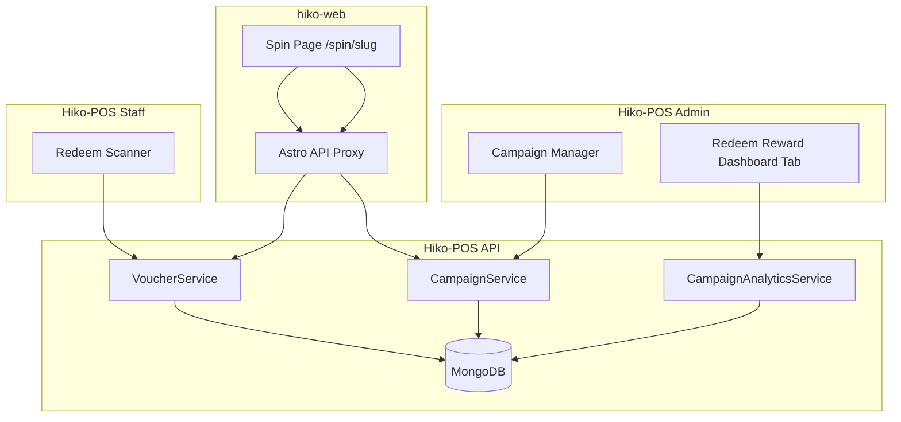

# Redeem Reward — Design Spec

**Date:** 2026-08-04  
**Status:** Approved  
**Plan:** `docs/superpowers/plans/2026-08-04-redeem-reward.md`  
**Repos:** Hiko-POS (backend, pos-frontend), hiko-web (customer spin page)

---

## Overview

A **campaign-based spin game** where admins configure prize wheels, customers play on **hiko-web** with their phone number, and staff **validate vouchers via QR scan** in Hiko-POS. Admins analyze campaign performance from a dedicated **Dashboard tab**.

This is a new marketing system, separate from:

| System | Scope | Purpose |
|--------|-------|---------|
| `RewardProgram` | Global loyalty | Dish-count tiers, staff applies at checkout |
| `Promotion` | Per store | Coupon codes, happy hour |
| **Redeem Reward** (new) | Brand-wide campaigns | Spin game → one-time voucher → staff QR scan |

---

## Key Decisions

| Decision | Choice |
|----------|--------|
| Campaign scope | **Brand-wide** — redeemable at any Hiko store |
| Reward types | **Percentage discount** or **free product** |
| Wheel | Weighted random; includes **"Try again" (no prize)** slots |
| Customer identity | **Phone number** (10 digits, links to `Customer`) |
| Play limit | Admin sets **max plays per phone** per campaign |
| Redeem at POS | **Validate only** — staff applies discount/item manually |
| Voucher expiry | **None after win** — valid until redeemed or campaign ends |
| Voucher recovery | **Phone lookup** — customer can retrieve QR if not redeemed |
| Spin fairness | **Server-side** weighted random — client only animates |
| Analytics | **Dashboard tab** for admin (brand-wide, date-filtered) |

---

## Architecture



**New backend module:** `campaign/` — models, services, controllers, routes  
**New frontend components:** `CampaignManager`, `RedeemRewardDashboard`, `RedeemScanner`  
**Customer surface:** hiko-web spin page

---

## Data Model

### `Campaign`

```typescript
Campaign {
  name: string
  slug: string                    // unique, URL-safe → /spin/{slug}
  description?: string
  startDate?: Date
  endDate?: Date
  isActive: boolean
  maxPlaysPerPhone: number        // default 1
  wheelSlots: WheelSlot[]
  createdBy: ref User
  createdAt, updatedAt
}

WheelSlot {
  label: string                   // "10% Off", "Try Again"
  rewardType: "percentage_discount" | "free_product" | "no_prize"
  discountPercent?: number
  freeDish?: ref Dish
  weight: number                  // relative probability
  color: string                   // hex for wheel segment
}
```

### `CampaignParticipation`

```typescript
CampaignParticipation {
  campaign: ref Campaign
  phone: string
  customer?: ref Customer         // auto-link on first play
  playCount: number
  lastPlayedAt: Date
}
// unique index: (campaign, phone)
```

### `CampaignVoucher`

```typescript
CampaignVoucher {
  campaign: ref Campaign
  participation: ref CampaignParticipation
  voucherCode: string             // e.g. "HK-A3X9K2" — unique
  qrToken: string                 // opaque signed token — unique
  rewardType: "percentage_discount" | "free_product"
  discountPercent?: number
  freeDish?: ref Dish
  rewardLabel: string             // snapshot for display
  status: "active" | "redeemed" | "expired"
  wonAt: Date
  expiresAt?: Date                // = campaign.endDate if set
  redeemedAt?: Date
  redeemedBy?: ref User
  redeemedAtStore?: ref Store
}
```

**Status rules**

- `active` — won, not yet scanned
- `redeemed` — staff confirmed scan
- `expired` — campaign ended without redemption

---

## API Endpoints

### Admin — JWT + `isAdmin`

| Method | Endpoint | Purpose |
|--------|----------|---------|
| GET | `/api/campaign` | List campaigns |
| POST | `/api/campaign` | Create |
| GET | `/api/campaign/:id` | Detail |
| PUT | `/api/campaign/:id` | Update |
| DELETE | `/api/campaign/:id` | Deactivate |
| GET | `/api/campaign/analytics/dashboard` | Brand-wide dashboard analytics |

**Dashboard analytics query params**

| Param | Type | Description |
|-------|------|-------------|
| `startDate` | ISO date | Filter start (from Dashboard date bar) |
| `endDate` | ISO date | Filter end |
| `campaignId` | ObjectId (optional) | Filter to one campaign; omit for all |

**Dashboard analytics response**

```typescript
{
  summary: {
    totalPlays: number
    totalWins: number
    totalLosses: number           // no_prize outcomes
    winRate: number               // wins / plays (%)
    vouchersRedeemed: number
    redemptionRate: number        // redeemed / wins (%)
    activeVouchers: number        // won, not redeemed, campaign still active
    uniqueParticipants: number    // distinct phones
  }
  campaignPerformance: [{
    campaignId: string
    name: string
    slug: string
    isActive: boolean
    plays: number
    wins: number
    losses: number
    winRate: number
    redeemed: number
    redemptionRate: number
    activeVouchers: number
  }]
  prizeDistribution: [{
    rewardLabel: string
    rewardType: string
    count: number                 // vouchers issued for this prize
    redeemed: number
  }]
  redemptionsByStore: [{
    storeId: string
    storeName: string
    count: number
  }]
  dailyTrend: [{
    date: string                  // YYYY-MM-DD
    plays: number
    wins: number
    redemptions: number
  }]
  recentActivity: [{
    type: "play" | "win" | "redeem"
    phone: string                 // masked: 09****1234
    campaignName: string
    rewardLabel?: string
    storeName?: string
    timestamp: Date
  }]
}
```

### Public — Customer (rate-limited, no auth)

| Method | Endpoint | Body | Purpose |
|--------|----------|------|---------|
| GET | `/api/campaign/:slug/public` | — | Campaign info for wheel UI |
| POST | `/api/campaign/:slug/play` | `{ phone }` | Spin + outcome |
| POST | `/api/campaign/:slug/lookup` | `{ phone }` | Retrieve active voucher |

**`POST /play` responses**

Win:
```json
{
  "result": "win",
  "reward": { "label": "10% Off", "type": "percentage_discount", "discountPercent": 10 },
  "voucher": { "code": "HK-A3X9K2", "qrToken": "...", "expiresAt": null }
}
```

Lose:
```json
{
  "result": "lose",
  "message": "Try again next time",
  "playsRemaining": 0
}
```

### Staff — JWT + store context

| Method | Endpoint | Purpose |
|--------|----------|---------|
| GET | `/api/voucher/validate/:qrToken` | Preview before confirm |
| POST | `/api/voucher/redeem` | `{ qrToken }` → atomic redeem |

Redeem uses `findOneAndUpdate({ qrToken, status: 'active' })` for one-time use.

---

## User Flows

### Customer — First visit

1. Open `hikomatcha.vn/spin/{slug}`
2. Enter phone → tap **Spin**
3. Wheel animates; server returns outcome
4. **Win** → voucher screen with code + QR
5. **Lose** → "Try again next time" (if plays remain)

### Customer — Return visit

1. Same link → enter phone → **Lookup**
2. Active voucher → show QR again
3. Redeemed → "Already used on {date}"
4. No plays and no voucher → "You've already played"

### Staff — Redeem

1. Open **Redeem Reward** in POS
2. Scan customer QR
3. See prize details → **Confirm Redeem**
4. Staff applies discount/item manually at checkout

---

## Frontend Surfaces

### 1. Admin — Campaign Manager (`CampaignManager.jsx`)

New admin page (pattern: `PromotionManager.jsx`):

- Campaign list with status, dates, quick stats
- Create/edit: name, slug, dates, max plays, active toggle
- Wheel slot editor: type, dish picker, weight, color
- Weight preview per slot
- Copy campaign link button

Route: `/campaigns` (admin only), sidebar under Menu Management.

### 2. Admin — Dashboard Tab (`RedeemRewardDashboard.jsx`)

New tab on the existing Dashboard page, **admin only**, alongside Metrics, Promotions, Rewards, etc.

**Integration in `Dashboard.jsx`**

```javascript
// Add to tabs array (admin only):
["Metrics", "Promotions", ..., "Rewards", "Redeem Reward"]

// Render when active:
{activeTab === "Redeem Reward" && isAdmin && (
  <RedeemRewardDashboard
    dateFilter={dateFilter}
    customDateRange={customDateRange}
  />
)}
```

Uses the shared `DateFilterBar` (Today / This Week / This Month / Custom) — same as Promotions tab.

**Layout (follows `RewardsDashboard.jsx` / `PromotionMetrics.jsx` patterns)**

```
┌─────────────────────────────────────────────────────────────┐
│  Campaign: [ All Campaigns ▼ ]                              │
├──────────┬──────────┬──────────┬──────────┬─────────────────┤
│  Plays   │  Wins    │ Win Rate │ Redeemed │ Active Vouchers │
├──────────┴──────────┴──────────┴──────────┴─────────────────┤
│  Campaign Performance (table)                               │
│  Prize Distribution          │  Daily Trend (plays/wins)    │
│  Redemptions by Store (StoreSummariesTable)                 │
│  Recent Activity (last 20 events)                           │
└─────────────────────────────────────────────────────────────┘
```

**KPI cards**

| Card | Source |
|------|--------|
| Total Plays | `summary.totalPlays` |
| Vouchers Won | `summary.totalWins` |
| Win Rate | `summary.winRate` % |
| Redeemed | `summary.vouchersRedeemed` |
| Redemption Rate | `summary.redemptionRate` % |
| Active Vouchers | `summary.activeVouchers` |
| Participants | `summary.uniqueParticipants` |

**Campaign Performance table** — one row per campaign in date range:

| Column | Description |
|--------|-------------|
| Campaign | Name + active badge |
| Plays | Total spin attempts |
| Wins / Losses | Voucher issued vs no-prize |
| Win Rate | % |
| Redeemed | Staff scans |
| Redemption Rate | redeemed / wins |
| Active | Unredeemed vouchers |

Row click → filters dashboard to that campaign (sets campaign dropdown).

**Prize Distribution** — bar list of each reward label with count and redeemed count.

**Redemptions by Store** — reuse `StoreSummariesTable` (same as Rewards dashboard).

**Daily Trend** — simple list or bar chart: plays, wins, redemptions per day.

**Recent Activity** — scrollable feed: masked phone, event type, campaign, timestamp.

**Redux slice:** `campaignSlice.js` with `fetchCampaignDashboardAnalytics`  
**API helper:** `GET /api/campaign/analytics/dashboard` in `https/index.js`

### 3. Customer — Spin page (hiko-web)

Route: `/src/pages/spin/[slug].astro`

- Mobile-first, matcha brand styling
- Phone input (10-digit VN validation)
- Client island for wheel animation
- QR display after win
- Astro API proxy for play/lookup
- Update POS CORS + hiko-web CSP

### 4. Staff — Redeem Scanner (`RedeemReward.jsx`)

New staff page (all authenticated roles with store context):

- Camera QR scanner + manual code fallback
- Voucher detail card before confirm
- Clear error states (invalid, redeemed, expired)

Sidebar item: **Redeem Reward** (visible to all staff, not admin-only).

---

## Security & Anti-Abuse

| Risk | Mitigation |
|------|------------|
| Client-side cheating | Server picks prize |
| Brute-force codes | Opaque signed `qrToken` |
| Double redeem | Atomic status update |
| Play spam | Rate limit `/play` and `/lookup` by IP + phone |
| Phone farming | `maxPlaysPerPhone` + unique participation index |
| Campaign ended | Validate on every play/redeem/lookup |

**CORS:** Add `hikomatcha.vn` and Vercel preview URLs to POS backend.

---

## Build Phases

| Phase | Deliverable |
|-------|-------------|
| **1 — Backend foundation** | Models, CampaignService, admin CRUD API |
| **2 — Admin UI** | Campaign manager page |
| **3 — Dashboard analytics** | Analytics API + `RedeemRewardDashboard` tab |
| **4 — Customer spin** | Public APIs + hiko-web spin page |
| **5 — Staff redeem** | QR scanner + validate/redeem in POS |
| **6 — Polish** | Expiry cron for ended campaigns, edge-case UX |

Phases 1–5 = MVP. Phase 6 can follow.

---

## Out of Scope (v1)

- Auto-apply voucher to cart/order
- SMS delivery of voucher link
- OTP phone verification
- Per-store campaign restrictions
- Integration with `Promotion` or `RewardProgram`

---

## Error Handling

| Scenario | Customer | Staff |
|----------|----------|-------|
| Campaign inactive/ended | "Campaign has ended" | — |
| No plays left | "Already played" | — |
| Invalid QR | — | "Invalid voucher" |
| Already redeemed | "Used on {date}" | "Already redeemed" |
| Expired voucher | "Campaign ended" | "Voucher expired" |

---

## File Checklist (implementation reference)

### Backend (Hiko-POS)

- `models/campaignModel.ts`
- `models/campaignParticipationModel.ts`
- `models/campaignVoucherModel.ts`
- `services/campaignService.ts`
- `services/campaignAnalyticsService.ts`
- `controllers/campaignController.ts`
- `controllers/voucherController.ts`
- `routes/campaignRoute.ts`
- `routes/voucherRoute.ts`
- Register routes in `app.ts`

### Frontend — POS

- `pages/CampaignManager.jsx`
- `pages/RedeemReward.jsx` (staff scanner)
- `components/dashboard/RedeemRewardDashboard.jsx`
- `components/campaign/*` (forms, slot editor)
- `redux/slices/campaignSlice.js`
- Update `Dashboard.jsx` — add tab
- Update `constants/index.js` — routes
- Update `Sidebar.jsx` — campaign manager + redeem scanner links

### Frontend — hiko-web

- `pages/spin/[slug].astro`
- `components/spin/SpinWheel.tsx` (or Svelte)
- `pages/api/campaign/[slug]/play.ts`
- `pages/api/campaign/[slug]/lookup.ts`
- Update `vercel.json` CSP
