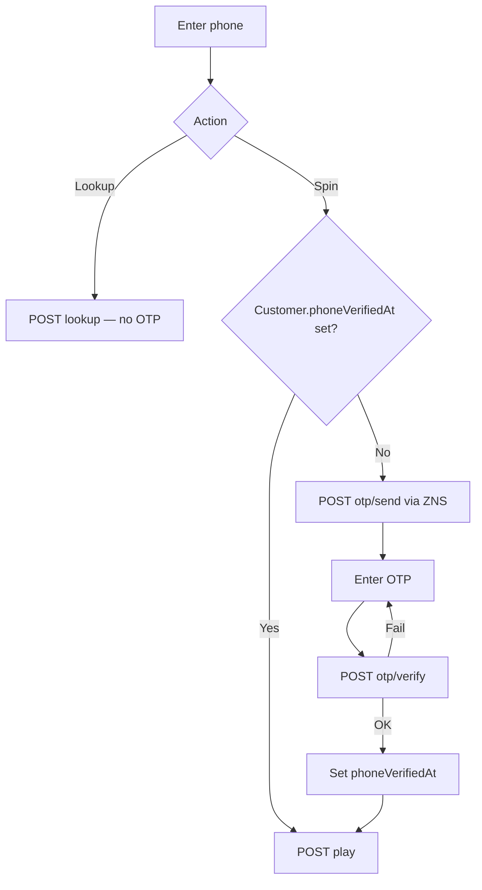

# ZNS Phone OTP Verification — Design Spec

**Date:** 2026-08-06  
**Status:** Approved  
**Plan:** `docs/superpowers/plans/2026-08-06-zns-phone-otp.md`  
**Repos:** Hiko-POS (`pos-backend`), hiko-web (spin page)  
**Extends:** `docs/superpowers/specs/2026-08-04-redeem-reward-design.md`

---

## Overview

Add **one-time Zalo ZNS OTP verification** before a customer can **spin** on the redeem-reward campaign page. After a phone is verified successfully, that number is marked verified on `Customer` and **never requires OTP again** for spin or voucher lookup.

Lookup (“Xem voucher”) stays **phone-only** (no OTP), including before first verification.

---

## Key Decisions

| Decision | Choice |
|----------|--------|
| When OTP is required | **Spin only** — not lookup |
| After successful verify | Persist forever on `Customer`; no OTP on return visits |
| Storage | `Customer.phoneVerifiedAt` (brand-wide, all campaigns) |
| Channel | Zalo ZNS “Mẫu xác thực” (template ID `619202`, param `otp`) |
| Approach | Separate `otp/send` + `otp/verify` APIs; `play` gates on verified phone |
| SMS fallback | Out of scope |
| Per-campaign OTP toggle | Out of scope |

---

## Customer Flow



1. Customer enters 10-digit phone (existing normalize: `912345678` → `0912345678`).
2. **Quay Ngay:**
   - If phone already verified → call play immediately.
   - If not → send OTP → show OTP UI → verify → then play.
3. **Xem voucher:** always lookup by phone only (unchanged auth model).
4. Next visit with the same phone: spin and lookup without OTP.

---

## Data Model

### `Customer` (extend)

```typescript
phoneVerifiedAt?: Date  // set once on successful OTP verify; never cleared in v1
```

- Existing phone rules unchanged: `/^\d{10}$/`, unique index.
- Create `Customer` on first `otp/send` if missing (same as play today creates on first spin).

### Pending OTP (new)

Ephemeral record for outstanding codes (Mongo collection or equivalent):

```typescript
PhoneOtpChallenge {
  phone: string           // 10 digits
  codeHash: string        // hash of OTP (never store plaintext)
  expiresAt: Date         // e.g. now + 5 minutes
  attemptCount: number    // increment on failed verify
  lastSentAt: Date        // for resend cooldown
  createdAt: Date
}
```

- Unique index on `phone` (one active challenge per phone; send replaces prior).
- TTL index on `expiresAt` optional for cleanup.

---

## Zalo / ZNS Integration

### Config (env only — never commit secrets)

| Variable | Purpose |
|----------|---------|
| `ZALO_APP_ID` | App ID |
| `ZALO_OA_ID` | Official Account ID |
| `ZALO_SECRET_KEY` | App secret (refresh) |
| `ZALO_ACCESS_TOKEN` | Current access token (bootstrap / cache) |
| `ZALO_REFRESH_TOKEN` | Refresh token |
| `ZNS_OTP_TEMPLATE_ID` | `619202` |
| `ZNS_OTP_PARAM_NAME` | `otp` |

### Behavior

- Normalize phone for ZNS: `0912345678` → `84912345678`.
- Send template with `template_data: { otp: "<code>" }`.
- On Zalo auth errors (expired token), refresh access token via refresh token + secret, persist new tokens in memory/env-safe store for process lifetime (document ops note: re-bootstrap from env on deploy; optional later: encrypted DB store for rotated tokens).
- OTP code: 6 digits, cryptographically random.
- Do not log OTP plaintext or full tokens.

---

## API

Public, rate-limited (same family as campaign play limiter). Mount under `/api/campaign`.

### `POST /api/campaign/:slug/otp/send`

**Body:** `{ phone: string }`

**Rules:**
- Campaign must exist and be playable (same checks as play), otherwise 404/400.
- Phone must match `/^\d{10}$/`.
- If `Customer.phoneVerifiedAt` already set → `{ success: true, alreadyVerified: true }` (no ZNS send).
- Resend cooldown: e.g. 60s since `lastSentAt` → 429.
- Generate OTP, store hash, send ZNS.
- Response never includes the code.

**Success:** `{ success: true, alreadyVerified: false, expiresInSeconds: 300 }`

### `POST /api/campaign/:slug/otp/verify`

**Body:** `{ phone: string, otp: string }`

**Rules:**
- Load challenge; reject if missing/expired.
- Cap attempts (e.g. 5); then invalidate challenge → 429/400.
- On match: set `Customer.phoneVerifiedAt = now`, delete challenge.
- Response: `{ success: true, verified: true }`

### `POST /api/campaign/:slug/play` (change)

Before existing play logic:

- Ensure Customer exists (create if needed).
- If `!customer.phoneVerifiedAt` → **403** with message suitable for UI, e.g. code `PHONE_NOT_VERIFIED`.

### `POST /api/campaign/:slug/lookup`

Unchanged — no OTP gate.

### hiko-web proxies

- `POST /api/campaign/[slug]/otp/send`
- `POST /api/campaign/[slug]/otp/verify`

Same pattern as existing play/lookup proxies (`HIKO_POS_API_URL`).

---

## Frontend (hiko-web)

Extend spin UX (`PhoneForm` / `SpinApp`):

| State | UI |
|-------|-----|
| `phone` | Existing phone + Spin / Lookup |
| `otp` | OTP input, Confirm, Resend (respect cooldown) |
| After verify | Proceed to existing spin animation / result |

Spin click sequence:

1. Normalize phone.
2. Call `otp/send` (or a lightweight check: send returns `alreadyVerified`).
3. If `alreadyVerified` → call play.
4. Else → show OTP step → verify → play.

Lookup click: unchanged (direct lookup).

Copy (VI): short hints for “mã gửi qua Zalo”, wrong code, expired, resend wait.

---

## Security & Limits

| Control | Value (v1 defaults) |
|---------|---------------------|
| OTP length | 6 digits |
| OTP TTL | 5 minutes |
| Resend cooldown | 60 seconds |
| Max verify attempts per challenge | 5 |
| Rate limit send/verify | Align with campaign play limiter (tighten if needed) |
| Storage | Hash OTP (e.g. SHA-256 with server pepper or bcrypt) |

Known trade-off (accepted): once a phone is verified, anyone who knows that number can spin (within play limits) and lookup without OTP. This matches the product choice of permanent verify-for-convenience.

---

## Error Handling

| Scenario | Customer-facing |
|----------|-----------------|
| ZNS send failure | “Không gửi được mã. Thử lại sau.” |
| Resend too soon | “Vui lòng đợi trước khi gửi lại.” |
| Wrong OTP | “Mã không đúng.” |
| Expired OTP | “Mã đã hết hạn. Gửi lại mã mới.” |
| Too many attempts | “Thử quá nhiều lần. Gửi lại mã mới.” |
| Play without verify | UI should not call play; API returns `PHONE_NOT_VERIFIED` |
| Campaign not playable | Existing campaign errors |

---

## Testing

- Unit: phone normalize to `84…`, OTP hash verify, cooldown/attempt logic.
- Integration: send → verify → play succeeds; play without verify fails; second play/visit skips OTP; lookup never requires OTP; expired/wrong OTP.
- Manual: real ZNS to a test phone on template `619202` (dev/prod mode as configured in ZBS).

---

## Out of Scope

- SMS / voice fallback
- OTP for lookup
- Per-campaign or per-store OTP settings
- Clearing / admin-reset of `phoneVerifiedAt` UI
- Auto-apply voucher to order
- Committing Zalo secrets to git (Railway / local `.env` only)

---

## File Checklist (implementation reference)

### Hiko-POS

- `pos-backend/models/customerModel.ts` — add `phoneVerifiedAt`
- `pos-backend/models/phoneOtpChallengeModel.ts` (or equivalent)
- `pos-backend/services/zaloZnsService.ts` — send + token refresh
- `pos-backend/services/phoneOtpService.ts` — send/verify/challenge
- `pos-backend/controllers/campaignController.ts` — otp handlers; play gate
- `pos-backend/routes/campaignRoute.ts` — public otp routes
- `pos-backend/config` / env example — Zalo vars
- Tests for OTP + play gate

### hiko-web

- OTP step UI in spin components
- `src/pages/api/campaign/[slug]/otp/send.ts`
- `src/pages/api/campaign/[slug]/otp/verify.ts`

---

## Spec Self-Review

- [x] No placeholders left for product decisions
- [x] Consistent with redeem-reward: phone identity, play limits, lookup without OTP
- [x] Secrets documented as env-only
- [x] Scope bounded (no SMS, no lookup OTP)
)
