# Database Schema & Entity Relationship Diagram

## Overview

This document provides a comprehensive overview of all database models and their relationships in the Hiko POS Backend system.

## Entity Relationship Diagram

```mermaid
erDiagram
    %% Core Entities
    User ||--o{ Order : creates
    User ||--o{ Promotion : creates
    User ||--o{ Schedule : creates
    User ||--o{ ExtraWork : "assigned to"
    User ||--o{ Spending : creates
    User ||--o{ DishRecipe : creates
    User ||--o{ Ingredient : creates
    
    %% Menu & Catalog
    Category ||--o{ Dish : "categorizes"
    Dish ||--o{ OrderItem : "contains"
    Dish ||--|| DishRecipe : "has recipe"
    Dish }o--o{ Topping : "compatible with"
    Topping ||--|| ToppingRecipe : "has recipe"
    
    %% Orders & Payments
    Order ||--o{ OrderItem : contains
    Order }o--o| Promotion : "applies"
    Order }o--o| Table : "assigned to"
    Order }o--o| Payment : "processed via"
    Customer }o--o{ Order : "places"
    
    %% Inventory & Recipes
    Ingredient ||--o{ DishRecipe : "used in"
    Ingredient ||--o{ ToppingRecipe : "used in"
    Ingredient ||--o{ IngredientTransaction : "tracks"
    Ingredient }o--o{ Vendor : "supplied by"
    
    %% Recipes
    DishRecipe }o--o{ Ingredient : "requires"
    ToppingRecipe }o--o{ Ingredient : "requires"
    
    %% Spending & Finance
    SpendingCategory ||--o{ Spending : "categorizes"
    Vendor ||--o{ Spending : "supplied by"
    Spending }o--o| User : "approved by"
    
    %% Scheduling
    ShiftTemplate ||--o{ Schedule : "defines"
    Schedule }o--o{ User : "assigns"
    
    %% Order Items Relationships
    OrderItem }o--o{ Topping : "includes"
    OrderItem }o--o| Dish : "references"
    OrderItem }o--o{ Promotion : "applied by"
    
    %% Transaction Tracking
    IngredientTransaction }o--o| Order : "exported for"
    IngredientTransaction }o--o| Dish : "used in"
    IngredientTransaction }o--o| Vendor : "imported from"
    
    %% User Entity
    User {
        ObjectId _id PK
        string name
        string email
        string phone UK
        string password
        string role
        number salary
        boolean isActive
        date createdAt
        date updatedAt
    }
    
    %% Category Entity
    Category {
        ObjectId _id PK
        string name UK
        string description
        string color
        boolean isActive
        date createdAt
        date updatedAt
    }
    
    %% Dish Entity
    Dish {
        ObjectId _id PK
        string name
        number price
        ObjectId category FK
        number cost
        string note
        string image
        array sizeVariants
        boolean hasSizeVariants
        object ingredients
        boolean isAvailable
        array compatibleToppings
        boolean allowToppings
        date createdAt
        date updatedAt
    }
    
    %% Order Entity
    Order {
        ObjectId _id PK
        object customerDetails
        string orderStatus
        date orderDate
        object bills
        array items
        string paymentMethod
        string thirdPartyVendor
        string paymentStatus
        object createdBy
        array appliedPromotions
        date createdAt
        date updatedAt
    }
    
    %% OrderItem (Embedded)
    OrderItem {
        ObjectId _id PK
        ObjectId dishId FK
        string name
        number originalPricePerQuantity
        number pricePerQuantity
        number quantity
        number originalPrice
        number price
        array promotionsApplied
        boolean isHappyHourItem
        number happyHourDiscount
        string category
        string image
        object variant
        string note
        array toppings
    }
    
    %% Customer Entity
    Customer {
        ObjectId _id PK
        string name
        string phone UK
        number point
        string class
        date createdAt
        date updatedAt
    }
    
    %% Table Entity
    Table {
        ObjectId _id PK
        number tableNo UK
        string status
        number seats
        ObjectId currentOrder FK
    }
    
    %% Payment Entity
    Payment {
        ObjectId _id PK
        string paymentId
        string orderId
        number amount
        string currency
        string status
        string method
        string email
        string contact
        date createdAt
    }
    
    %% Promotion Entity
    Promotion {
        ObjectId _id PK
        string name
        string description
        string code UK
        string type
        object discount
        string discountType
        string applicableItems
        array specificDishes FK
        array categories FK
        object conditions
        boolean isActive
        date startDate
        date endDate
        number usageCount
        number priority
        object createdBy
        date createdAt
        date updatedAt
    }
    
    %% Topping Entity
    Topping {
        ObjectId _id PK
        string name
        string description
        number price
        string category
        boolean isAvailable
        date createdAt
        date updatedAt
    }
    
    %% Ingredient Entity
    Ingredient {
        ObjectId _id PK
        string name UK
        string code UK
        string description
        string category
        string unit
        object inventory
        object costs
        object storage
        array suppliers
        boolean isActive
        object createdBy
        date createdAt
        date updatedAt
    }
    
    %% DishRecipe Entity
    DishRecipe {
        ObjectId _id PK
        ObjectId dishId FK
        array ingredients
        array sizeVariantRecipes
        number totalIngredientCost
        number costPerServing
        number servings
        number prepTime
        string instructions
        boolean isActive
        object createdBy
        date createdAt
        date updatedAt
    }
    
    %% ToppingRecipe Entity
    ToppingRecipe {
        ObjectId _id PK
        ObjectId toppingId FK
        array ingredients
        number totalIngredientCost
        number costPerServing
        object yield
        number preparationTime
        string preparationNotes
        boolean isActive
        date createdAt
        date updatedAt
    }
    
    %% IngredientTransaction Entity
    IngredientTransaction {
        ObjectId _id PK
        string transactionNumber UK
        string type
        ObjectId ingredientId FK
        number quantity
        string unit
        number unitCost
        number totalCost
        number stockBefore
        number stockAfter
        object importDetails
        object exportDetails
        object adjustmentDetails
        date transactionDate
        string status
        object createdBy
        date createdAt
        date updatedAt
    }
    
    %% Spending Entity
    Spending {
        ObjectId _id PK
        string title
        number amount
        string currency
        ObjectId category FK
        ObjectId vendor FK
        string vendorName
        string paymentStatus
        string paymentMethod
        date paymentDate
        string paymentReference
        string receiptNumber
        string invoiceNumber
        boolean isRecurring
        object recurringPattern
        ObjectId parentSpendingId FK
        string approvalStatus
        object approvedBy
        array attachments
        string status
        object createdBy
        date createdAt
        date updatedAt
    }
    
    %% SpendingCategory Entity
    SpendingCategory {
        ObjectId _id PK
        string name UK
        string description
        string color
        boolean isActive
        date createdAt
        date updatedAt
    }
    
    %% Vendor Entity
    Vendor {
        ObjectId _id PK
        string name
        string phone
        boolean isActive
        date createdAt
        date updatedAt
    }
    
    %% Schedule Entity
    Schedule {
        ObjectId _id PK
        date date
        ObjectId shiftTemplate FK
        array assignedMembers
        number weekNumber
        number year
        string notes
        ObjectId createdBy FK
        ObjectId lastModifiedBy FK
        date createdAt
        date updatedAt
    }
    
    %% ShiftTemplate Entity
    ShiftTemplate {
        ObjectId _id PK
        string name UK
        string shortName
        string startTime
        string endTime
        string color
        string description
        boolean isActive
        number durationHours
        date createdAt
        date updatedAt
    }
    
    %% ExtraWork Entity
    ExtraWork {
        ObjectId _id PK
        ObjectId member FK
        date date
        number durationHours
        string workType
        string description
        boolean isApproved
        ObjectId approvedBy FK
        date approvedAt
        boolean isPaid
        date paidAt
        number hourlyRate
        number paymentAmount
        string notes
        ObjectId createdBy FK
        ObjectId lastModifiedBy FK
        date createdAt
        date updatedAt
    }
```

## Model Relationships Summary

### 1. User Relationships
- **Creates Orders**: One-to-Many (User → Order)
- **Creates Promotions**: One-to-Many (User → Promotion)
- **Creates Schedules**: One-to-Many (User → Schedule)
- **Assigned to Schedules**: Many-to-Many (User ↔ Schedule via assignedMembers)
- **Has ExtraWork**: One-to-Many (User → ExtraWork)
- **Creates Spending**: One-to-Many (User → Spending)
- **Approves Spending**: One-to-Many (User → Spending)
- **Creates Recipes**: One-to-Many (User → DishRecipe, ToppingRecipe)
- **Creates Ingredients**: One-to-Many (User → Ingredient)

### 2. Menu & Catalog Relationships
- **Category → Dish**: One-to-Many (Category categorizes Dishes)
- **Dish → OrderItem**: One-to-Many (Dish appears in OrderItems)
- **Dish → DishRecipe**: One-to-One (Each Dish has one Recipe)
- **Dish ↔ Topping**: Many-to-Many (Dishes compatible with Toppings)
- **Topping → ToppingRecipe**: One-to-One (Each Topping has one Recipe)

### 3. Order Relationships
- **Order → OrderItem**: One-to-Many (Order contains OrderItems - Embedded)
- **Order → Promotion**: Many-to-Many (Orders can have multiple Promotions)
- **Order → Table**: Many-to-One (Order assigned to Table)
- **Order → Payment**: One-to-One (Order processed via Payment)
- **Customer → Order**: One-to-Many (Customer places Orders)
- **OrderItem → Dish**: Many-to-One (OrderItem references Dish)
- **OrderItem → Topping**: Many-to-Many (OrderItem can include Toppings)
- **OrderItem → Promotion**: Many-to-Many (OrderItem can have Promotions applied)

### 4. Inventory & Recipe Relationships
- **Ingredient → DishRecipe**: Many-to-Many (Ingredients used in Dish Recipes)
- **Ingredient → ToppingRecipe**: Many-to-Many (Ingredients used in Topping Recipes)
- **Ingredient → IngredientTransaction**: One-to-Many (Ingredient tracked via Transactions)
- **Ingredient ↔ Vendor**: Many-to-Many (Ingredients supplied by Vendors)
- **IngredientTransaction → Order**: Many-to-One (Transactions for Order exports)
- **IngredientTransaction → Dish**: Many-to-One (Transactions for Dish production)

### 5. Spending & Finance Relationships
- **SpendingCategory → Spending**: One-to-Many (Category categorizes Spending)
- **Vendor → Spending**: One-to-Many (Vendor supplies Spending)
- **Spending → User**: Many-to-One (Spending approved by User)
- **Spending → Spending**: One-to-Many (Recurring Spending parent-child)

### 6. Scheduling Relationships
- **ShiftTemplate → Schedule**: One-to-Many (Template defines Schedules)
- **Schedule → User**: Many-to-Many (Schedule assigns Users via assignedMembers)
- **Schedule → ShiftTemplate**: Many-to-One (Schedule uses Template)

## Key Features

### Embedded Documents
- **OrderItem**: Embedded in Order (not a separate collection)
- **Size Variants**: Embedded in Dish
- **Recipe Ingredients**: Embedded in DishRecipe and ToppingRecipe

### Reference Relationships
- **User references**: Used throughout for createdBy, approvedBy, assignedMembers
- **Dish references**: In OrderItem, Promotion, IngredientTransaction
- **Category references**: In Dish, Promotion
- **Promotion references**: In Order, OrderItem

### Indexes
All models have strategic indexes for:
- Foreign key lookups
- Date-based queries
- Status filtering
- Unique constraints

## Collection Names

Mongoose automatically pluralizes model names:
- `User` → `users`
- `Order` → `orders`
- `Dish` → `dishes`
- `Category` → `categories`
- `Customer` → `customers`
- `Table` → `tables`
- `Payment` → `payments`
- `Promotion` → `promotions`
- `Topping` → `toppings`
- `Ingredient` → `ingredients`
- `DishRecipe` → `dishrecipes`
- `ToppingRecipe` → `toppingrecipes`
- `IngredientTransaction` → `ingredienttransactions`
- `Spending` → `spendings`
- `SpendingCategory` → `spendingcategories`
- `Vendor` → `vendors`
- `Schedule` → `schedules`
- `ShiftTemplate` → `shifttemplates`
- `ExtraWork` → `extraworks`

## Data Flow Examples

### Order Creation Flow
1. **User** creates an **Order**
2. **Order** contains multiple **OrderItems** (embedded)
3. Each **OrderItem** references a **Dish**
4. **OrderItem** may include **Toppings**
5. **Promotions** can be applied to **Order** or **OrderItems**
6. **Order** can be assigned to a **Table**
7. **Payment** processes the **Order**

### Recipe & Inventory Flow
1. **Dish** has a **DishRecipe**
2. **DishRecipe** contains **Ingredients** with quantities
3. When **Order** is created, **IngredientTransactions** are created
4. **IngredientTransactions** update **Ingredient** inventory levels
5. **Ingredients** are supplied by **Vendors**

### Scheduling Flow
1. **ShiftTemplate** defines shift times
2. **Schedule** uses **ShiftTemplate** for a specific date
3. **Schedule** assigns **Users** via assignedMembers array
4. **ExtraWork** tracks additional hours for **Users**

## Notes

- All models include `timestamps: true` for automatic `createdAt` and `updatedAt`
- Most models have `isActive` flags for soft deletion
- User references are stored as `{ userId, userName }` objects for quick access
- OrderItems are embedded (not referenced) for performance and data consistency
- Promotions can be applied at both Order and OrderItem levels
